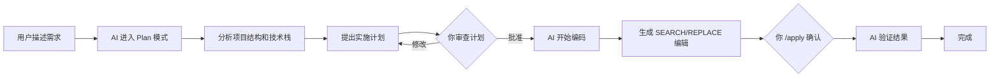

# Reasonix 完整使用指南

> **一句话概述**：Reasonix 是一个运行在终端里的 DeepSeek 原生 AI 编程助手——由配置驱动的极薄 harness，单一静态 Go 二进制，围绕 DeepSeek 的前缀缓存调优，长会话也能把 token 成本压低。你可以用自然语言让它帮你写代码、调试 Bug、管理项目，就像和一个资深程序员结对编程。

---

## 阅读说明

> 本文档基于 Reasonix **1.0+（Go 重写版）** 编写，对应 [esengine/DeepSeek-Reasonix](https://github.com/esengine/DeepSeek-Reasonix)（`main-v2` 分支）。早期 0.x TypeScript 版本已转为 legacy，保留在 `v1` 分支。
>
> Reasonix 是 **DeepSeek 原生**的设计，但支持任意 OpenAI 兼容端点。配置驱动，无硬编码模型。

---

## 目录

- [零、Reasonix 能力地图](#零reasonix-能力地图)
- [一、欢迎页](#一欢迎页)
  - [Reasonix 的独特之处](#reasonix-的独特之处)
  - [核心概念速览](#核心概念速览)
- [二、第一次使用（手把手教学）](#二第一次使用手把手教学)
- [三、配置详解](#三配置详解)
- [四、核心命令详解](#四核心命令详解)
  - [4.1 会话与上下文管理](#41-会话与上下文管理)
  - [4.2 编辑与版本管理](#42-编辑与版本管理)
  - [4.3 计划模式](#43-计划模式)
  - [4.4 Memory 模块（记忆系统）](#44-memory-模块记忆系统)
  - [4.5 Skill 系统（技能模块）](#45-skill-系统技能模块)
  - [4.6 插件系统（MCP）](#46-插件系统mcp)
  - [4.7 Sub-agents（子代理）](#47-sub-agents子代理)
  - [4.8 权限与沙盒](#48-权限与沙盒)
  - [4.9 模型与配置模块](#49-模型与配置模块)
  - [4.10 Hooks 模块（钩子系统）](#410-hooks-模块钩子系统)
  - [4.11 双模型协同](#411-双模型协同)
  - [4.12 后台任务与定时任务](#412-后台任务与定时任务)
- [五、桌面端与 Web 前端](#五桌面端与-web-前端)
- [六、快捷键参考](#六快捷键参考)
- [七、完整工作流示例](#七完整工作流示例)
- [八、常见问题与解决方案](#八常见问题与解决方案)
- [九、最佳实践建议](#九最佳实践建议)
- [十、快速参考手册](#十快速参考手册)

---

## 零、Reasonix 能力地图

在深入学习之前，先通过这张"能力地图"了解 Reasonix 所有功能模块的全貌：

```
┌──────────────────────────────────────────────────────────┐
│                    Reasonix 能力地图                       │
├──────────────────────────────────────────────────────────┤
│                                                          │
│  ┌──────────────┐  ┌──────────────┐  ┌──────────────┐   │
│  │  会话管理    │  │  编辑系统     │  │  计划模式    │   │
│  │  /new       │  │  /apply      │  │  /plan       │   │
│  │  /compact   │  │  /undo       │  │  Shift+Tab   │   │
│  │  /sessions  │  │  /history    │  │  submit_plan │   │
│  │  /rewind    │  │  /checkpoint │  │  只读规划    │   │
│  └──────────────┘  └──────────────┘  └──────────────┘   │
│                                                          │
│  ┌──────────────┐  ┌──────────────┐  ┌──────────────┐   │
│  │  Memory      │  │  Skill 技能  │  │  MCP 插件   │   │
│  │  持久化记忆  │  │  专业技能包  │  │  外部工具   │   │
│  │  四类记忆    │  │  内置+自定义  │  │  stdio+HTTP │   │
│  │  自动压缩    │  │  subagent模式 │  │  .mcp.json  │   │
│  └──────────────┘  └──────────────┘  └──────────────┘   │
│                                                          │
│  ┌──────────────┐  ┌──────────────┐  ┌──────────────┐   │
│  │  Sub-agents  │  │  权限沙盒    │  │  Hooks       │   │
│  │  隔离子代理  │  │  deny>ask    │  │  生命周期    │   │
│  │  并行探索    │  │  >allow>兜底 │  │  PreToolUse  │   │
│  │  代码审查    │  │  文件沙盒    │  │  PostToolUse │   │
│  └──────────────┘  └──────────────┘  └──────────────┘   │
│                                                          │
│  ┌──────────────┐  ┌──────────────┐  ┌──────────────┐   │
│  │  双模型协同  │  │  成本控制    │  │  Web 前端    │   │
│  │  执行器+规划器│  │  flash优先  │  │  reasonix    │   │
│  │  独立session │  │  自动压缩    │  │  serve       │   │
│  │  缓存稳定    │  │  自动升级    │  │  桌面端 GUI  │   │
│  └──────────────┘  └──────────────┘  └──────────────┘   │
│                                                          │
└──────────────────────────────────────────────────────────┘
```

> **阅读建议**：第一次使用建议从第一章读到第三章。已有基础可直接跳到第十章"快速参考手册"。

---

## 一、欢迎页

### Reasonix 能帮你做什么？

Reasonix 是一个 **DeepSeek 原生的终端 AI 编程助手**，由配置与插件驱动的极薄 harness。把它想象成一个坐在你旁边的资深程序员——你用自然语言告诉它想做什么，它就会帮你完成。

**典型场景**：
- "帮我创建一个 React 登录页面" → 它自动生成完整代码
- "这段代码为什么报错？" → 它分析错误并给出修复方案
- "给这个函数补单元测试" → 它生成测试代码
- "审查当前分支的变更" → 它逐文件审查正确性、安全性

### Reasonix 的独特之处

#### 1. DeepSeek 原生 · 缓存优先

Reasonix 的整个循环围绕 DeepSeek 的前缀缓存设计。上下文分为三个区域：

```
┌─────────────────────────────────────────┐
│ 不可变前缀 (IMMUTABLE PREFIX)           │ ← 会话内固定
│   system + tool_specs + few_shots       │ 缓存命中候选
├─────────────────────────────────────────┤
│ 追加日志 (APPEND-ONLY LOG)              │ ← 单调增长
│   [assistant₁][tool₁][assistant₂]...   │ 保持前缀稳定
├─────────────────────────────────────────┤
│ 易失暂存 (VOLATILE SCRATCH)             │ ← 每轮重置
│   推理过程、临时计划状态                 │ 不发送给上游
└─────────────────────────────────────────┘
```

#### 2. 配置驱动 · 无硬编码

Provider、agent、启用的工具、插件全部在 `reasonix.toml` 中声明，内核无硬编码模型。任意 OpenAI 兼容端点都是一条配置，不需改代码。

#### 3. 单二进制分发

`CGO_ENABLED=0` 单静态 Go 二进制；`npm i -g reasonix` 一条命令安装，自动拉取对应平台的原生二进制。支持 macOS、Linux、Windows（amd64 + arm64）。

#### 4. 插件系统（MCP）

外部工具以子进程形式运行，通过 stdio JSON-RPC 通信（MCP 兼容）。内置工具在编译期自注册。

#### 5. 故意不做的事

> Reasonix 是有立场的。有些事它故意不做：
> - **不多供应商**。DeepSeek 是深度优化的唯一后端（但兼容 OpenAI 协议端点）。
> - **不做 IDE 集成**。终端优先，diff 在 `git diff`，文件树在 `ls`。
> - **不追最难推理榜单**。Claude Opus 在某些榜单仍是赢家，但 DeepSeek 在编程任务上有竞争力。

### 核心概念速览

| 概念 | 通俗解释 |
|------|----------|
| **会话（Session）** | 你和 AI 的一次对话。每次启动 Reasonix 就是一个新会话。 |
| **上下文（Context）** | AI 能"记住"的内容。Reasonix 针对前缀缓存优化。 |
| **SEARCH/REPLACE** | Reasonix 的编辑方式——AI 搜索文件中的精确文本并替换，需 `/apply` 确认才落盘。 |
| **Plan 模式** | 只读规划模式，AI 只分析不修改，直到你批准计划。 |
| **Sub-agent** | 隔离的子代理（explore / research / review / security-review），不污染主上下文。 |
| **MCP** | 模型上下文协议——连接外部工具的标准化接口。 |
| **Prefix Cache** | DeepSeek 的缓存机制，命中时成本降低约 90%。 |
| **Checkpoint** | 快照——会话中所有文件变更的备份点，可 `/rewind` 回退。 |

## 二、第一次使用（手把手教学）

### 2.1 安装 Reasonix

#### 前置要求

- **Node.js** 16+（仅用于 `npm install` 拉取二进制）
- **DeepSeek API Key** — [去拿 Key](https://platform.deepseek.com/api_keys)

#### 安装命令

```bash
# 推荐方式（自动拉取对应平台的原生二进制）
npm i -g reasonix

# macOS 用户也可用 Homebrew
brew install esengine/reasonix/reasonix
```

> `npx reasonix` 也是可用路径，不用全局安装。

#### 验证安装

```bash
reasonix --version
# 应输出版本号（1.x+）
reasonix doctor
# 健康检查 — Node 版本、API Key、配置
```

### 2.2 启动 Reasonix

#### 进入项目目录

```bash
cd /你的项目路径/
```

#### 首次配置向导

```bash
reasonix setup
```

向导会：
1. 询问 DeepSeek API Key
2. 选择界面语言（中文/English）
3. 生成 `reasonix.toml` 配置文件
4. 将 API Key 保存到 Reasonix 全局 `.env`

或者手动设置：

```bash
export DEEPSEEK_API_KEY=sk-...
```

#### 启动编码模式

```bash
reasonix code
```

这是主要工作模式——挂载文件系统工具、shell 工具、SEARCH/REPLACE 审阅、计划模式。

#### 启动后看到什么？

启动后你会看到终端 TUI 界面：

- 顶部状态栏：显示当前模型、缓存命中率、会话成本
- 中部对话区：你和 AI 的对话
- 底部输入区：`>` 提示符，输入你的请求

#### 其他启动模式

| 命令 | 用途 |
|------|------|
| `reasonix code [dir]` | **编码模式**——文件系统 + SEARCH/REPLACE + 计划模式 |
| `reasonix chat` | **纯聊天**——不挂载文件系统/shell 工具 |
| `reasonix run "描述任务"` | **一次性运行**——结果输出到 stdout，适合 CI 管道 |
| `reasonix serve` | **启动 Web 前端**——浏览器 UI，适合远程开发 |
| `reasonix replay <转录>` | **回放**——重放 JSONL 转录文件 |

#### 如何退出？

- 输入 `/exit` 或 `/quit` 然后回车
- 或者连按两次 `Ctrl+C`
- 或者按 `Ctrl+D`

#### 快捷键入门

| 快捷键 | 功能 |
|--------|------|
| `Enter` | 发送消息 |
| `Shift+Enter` | 换行 |
| `↑` / `↓` | 浏览历史对话 |
| `Esc` | 取消当前操作 / 关闭菜单 |
| `Ctrl+C` | 取消运行中的 turn / 清空输入（空输入时连按两次退出） |
| `Ctrl+L` | 滚动到 transcript 底部 |
| `Tab` | 补全 @-mention、斜杠命令 |

### 2.3 启动后第一件事

运行 `/init` 让 Reasonix 扫描项目并生成基线 `REASONIX.md`（项目记忆）：

```bash
# 在 Reasonix 会话中输入
/init
```

这会告诉 AI 你的项目是什么、用什么技术栈、有什么重要约定。之后每次启动 Reasonix，AI 都会先读取这个文件。

#### 初始化项目记忆示例

`/init` 自动生成的 `REASONIX.md` 会包含项目结构、技术栈等基本信息。你也可以手动补充：

```markdown
# 项目概述
这是一个 React 个人网站项目，使用 Vite 构建。

## 技术栈
- 前端框架: React 18
- 构建工具: Vite
- CSS 方案: Tailwind CSS

## 常用命令
- npm run dev: 启动开发服务器
- npm run build: 构建生产版本
```

---

## 三、配置详解

### 3.1 `reasonix.toml` — 最小配置

一个 provider + 默认模型 就够跑起来：

```toml
default_model = "deepseek-flash"

[[providers]]
name        = "deepseek-flash"
kind        = "openai"
base_url    = "https://api.deepseek.com"
model       = "deepseek-v4-flash"
api_key_env = "DEEPSEEK_API_KEY"
```

### 3.2 完整配置示例

```toml
default_model = "deepseek-flash"

[ui]
# shortcut_layout = "desktop"       # classic|desktop；兼容旧配置

[agent]
max_steps = 0                       # 工具调用轮数上限；0=不限
reasoning_language = "auto"         # 思考过程语言：auto|zh|en
auto_plan = "off"                   # 计划模式是否自动开启

[[providers]]
name        = "deepseek-flash"
kind        = "openai"
base_url    = "https://api.deepseek.com"
model       = "deepseek-v4-flash"
api_key_env = "DEEPSEEK_API_KEY"

# 可选：第二个 provider（双模型协同）
[[providers]]
name        = "deepseek-pro"
kind        = "openai"
base_url    = "https://api.deepseek.com"
model       = "deepseek-v4-pro"
api_key_env = "DEEPSEEK_API_KEY"

[tools]
enabled = []                         # 空=全部内置工具
bash_timeout_seconds = 120           # 前台命令超时
mcp_call_timeout_seconds = 300       # MCP 调用超时

[permissions]
mode  = "ask"                        # 兜底：ask|allow|deny
deny  = ["Bash(rm -rf*)", "Bash(git push*)"]
allow = ["Bash(go test:*)", "Bash(npm run test:*)"]

[sandbox]
# workspace_root = ""                # 文件写工具限制在此目录；空=当前目录
# allow_write = ["/tmp"]             # 额外可写目录
# forbid_read = ["${HOME}/.ssh"]     # agent 不可读取的目录

[[plugins]]
name    = "example"
command = "reasonix-plugin-example"

[[plugins]]
name    = "stripe"
type    = "http"
url     = "https://mcp.stripe.com"
headers = { Authorization = "Bearer ${STRIPE_KEY}" }
```

### 3.3 配置优先级

**flag > `./reasonix.toml` > 用户配置文件 > 内置默认值**

用户配置文件位置：
- macOS/Linux：`~/.reasonix/config.toml`
- Windows：`%AppData%\reasonix\config.toml`

### 3.4 环境变量

| 变量 | 说明 |
|------|------|
| `DEEPSEEK_API_KEY` | DeepSeek API 密钥（必填） |
| `REASONIX_LANG` | 语言设置：`zh` / `en` |
| `REASONIX_MEMORY_COMPILER_LLM_CLASSIFICATION=true` | 启用 LLM 任务分类器 |

---

## 四、核心命令详解

### 4.1 会话与上下文管理

#### `/new`（或 `/reset`、`/clear`）— 新会话

- **作用**：开始一个新的对话
- **注意**：`/new` 会保存当前会话，`/clear` 会丢弃当前上下文且不保存

#### `/compact` — 压缩对话

- **作用**：将长对话历史压缩为摘要，释放上下文空间
- **什么时候用**：上下文使用超过 50% 时（状态栏会提示）
- **替代**：Reasonix 在每轮结束时自动压缩超大的工具结果（TURN_END_RESULT_CAP_TOKENS=3000）

#### `/sessions` — 管理会话

- **作用**：列出所有已保存会话，当前会话标记 ▸
- **恢复**：`reasonix --session <name>` 或 `reasonix --continue`

#### `/rewind` — 回退

- **作用**：基于快照的编辑安全网——回退到之前的对话状态
- **触发**：空闲且输入为空时双击 `Esc`，或输入 `/rewind`
- **支持动作**：回退对话、回退代码、分叉新分支、摘要

#### 会话生命周期 Flag

| Flag | 效果 |
|------|------|
| `--no-session` | 临时运行，不持久化 |
| `--session <name>` | 恢复/钉住指定会话 |
| `--continue` | 恢复最近一次会话 |
| `--new` | 强制新会话 |

---

### 4.2 编辑与版本管理

Reasonix 使用 **SEARCH/REPLACE** 编辑模式——AI 不会直接修改你的文件，而是生成编辑块，你需要用 `/apply` 确认后才写入磁盘。

#### `/apply [N]` — 应用编辑

- **作用**：将 AI 生成的编辑块写入磁盘
- **用法**：`/apply`（全部应用）或 `/apply 1`、`/apply 1,3`、`/apply 1-3`
- **查看**：编辑块会在对话中显示，有 `y`（接受）/ `n`（拒绝）选项

#### `/discard [N]` — 丢弃编辑

- **作用**：丢弃未应用的编辑块，不写入磁盘
- **用法**：`/discard` 或 `/discard 1`

#### `/undo` — 撤销

- **作用**：回滚上一次 `/apply` 的编辑批次
- **使用场景**：应用后发现改错了，立即撤销

#### `/history` — 编辑历史

- **作用**：列出本次会话的所有编辑批次
- **格式**：每个批次显示时间、文件、修改摘要

#### `/show [id]` — 查看编辑详情

- **作用**：查看某个编辑批次的完整 diff

#### `/checkpoint [name]` — 快照

- **作用**：对会话中所有修改过的文件创建快照
- **用法**：`/checkpoint`（自动命名）或 `/checkpoint my-snapshot`
- **管理**：`/checkpoint list` / `/checkpoint forget`

#### `/restore <name>` — 恢复快照

- **作用**：回滚到指定 checkpoint 时的文件状态

#### `/commit "msg"` — Git 提交

- **作用**：执行 `git add -A && git commit -m "msg"`
- **注意**：需要 Git 仓库上下文

---

### 4.3 计划模式

#### `/plan [on|off]` — 计划模式

- **作用**：切换只读规划模式
- **开启后**：AI 只能读取文件、搜索代码、分析问题，不能修改任何文件
- **核心流程**：
  1. 开启 Plan 模式
  2. AI 分析问题，提出实施计划
  3. 你审查计划，选择 **批准 / 修改 / 取消**
  4. 关闭 Plan 模式，AI 开始执行
- **切换快捷键**：`Shift+Tab`

#### `/goal <目标>` — 目标模式

- **作用**：持续追踪一个已保存的目标，直到完成、阻塞或清除
- **子命令**：
  - `/goal ` — 启动目标
  - `/goal --research ` — 带自动研究的持续目标
  - `/goal status` — 查看目标状态
  - `/goal clear` — 清除目标

#### `submit_plan` — 提交计划

AI 在执行复杂任务前会自动提交结构化计划供你审查。计划包含：
- 摘要和步骤列表
- 每个步骤的目标文件
- 风险和验收标准

---

### 4.4 Memory 模块（记忆系统）

#### 什么是 Memory？

Memory 是 Reasonix 的持久化记忆系统，让你告诉 AI 的偏好、项目背景和历史决策在会话间保留。

#### `/memory` — 管理记忆

- `/memory` — 列出所有记忆条目
- `/memory show <name>` — 查看记忆详情
- `/memory forget <name>` — 删除记忆
- `/memory clear` — 清空所有记忆

#### 四类记忆

| 类型 | scope | 用途 |
|------|-------|------|
| **user** | global | 你的角色、技能、偏好 |
| **feedback** | global/project | 纠正或确认的方法 |
| **project** | project | 项目事实和决策 |
| **reference** | global | 外部系统的指针 |

#### 项目记忆：`REASONIX.md`

`/init` 自动生成的 `REASONIX.md` 是项目级记忆文件，存放在项目根目录。AI 每次启动都会读取。

#### 用户记忆：`~/.reasonix/memory/`

跨项目的全局记忆，存储在用户目录下。

---

### 4.5 Skill 系统（技能模块）

#### 什么是 Skill？

Skill 是一套预定义的"专业技能包"，包含特定任务的知识、工作流程和指令。当 AI 加载一个 Skill 时，相当于临时请了一位该领域的专家。

#### `/skills` — 管理技能

- `/skills list` — 列出所有可用技能
- `/skills show <name>` — 查看技能详情
- `/skills new <name>` — 创建新技能

#### 内置技能

| 技能 | 功能描述 | 触发方式 |
|------|----------|----------|
| **explore** | 代码库探索——只读地宽网调查，返回精炼结论 | 自动调用 |
| **research** | 结合代码阅读与网络搜索的调研 | 自动调用 |
| **review** | 审查当前分支变更——正确性、安全性、缺失测试 | 自动调用 |
| **security-review** | 安全专项审查——注入、认证、密钥、反序列化等 | 自动调用 |
| **teach** | 教用户新技能或概念 | 手动 |
| **prototype** | 构建可运行的终端原型 | 手动 |
| **handoff** | 压缩对话为交接文档 | 手动 |

#### 创建自定义 Skill

```bash
/skills new my-skill         # 项目级：<project>/.reasonix/skills/my-skill.md
/skills new my-skill --global # 全局：~/.reasonix/skills/，跨项目共用
```

Skill 文件格式：


```markdown
---
description: 我的自定义技能——做某件事
---

## 技能说明

在这里写技能的具体工作流程和规则。
```

#### Skill 的两种运行模式

| 模式 | 说明 |
|------|------|
| **inline** | 技能内容嵌入父 prompt，在同一个上下文执行 |
| **subagent** | 技能在隔离的子代理中运行，不污染主上下文 |

---

### 4.6 插件系统（MCP）

#### 什么是 MCP？

**MCP（Model Context Protocol，模型上下文协议）** 是一个标准化接口，让 Reasonix 连接外部工具和服务。支持两种传输方式：

| 传输方式 | 示例 |
|----------|------|
| **stdio** | 本地子进程（Node.js、Python、Go 程序） |
| **Streamable HTTP** | 远程 API 服务 |

#### `/mcp` — MCP 管理

- `/mcp list` — 列出已连接的 MCP 服务器
- `/mcp search` — 搜索 MCP 服务器市场
- `/mcp install` — 安装 MCP 服务器
- `/mcp inspect <server>` — 查看服务器详情
- `/mcp browse` — 浏览 MCP 资源

#### 在 `reasonix.toml` 中配置插件

```toml
# 本地 stdio 插件
[[plugins]]
name    = "filesystem"
command = "npx"
args    = ["-y", "@modelcontextprotocol/server-filesystem", "/path"]

# 远程 HTTP 插件
[[plugins]]
name    = "stripe"
type    = "http"
url     = "https://mcp.stripe.com"
headers = { Authorization = "Bearer ${STRIPE_KEY}" }
```

#### `.mcp.json` 兼容 Claude Code

如果已有 Claude Code 的 `.mcp.json`，直接放在项目根目录，Reasonix 会原样读取：

```json
{
  "mcpServers": {
    "filesystem": {
      "command": "npx",
      "args": ["-y", "@modelcontextprotocol/server-filesystem", "/path"]
    }
  }
}
```

#### MCP 资源的访问

- **工具（Tools）**：以 `mcp__<server>__<tool>` 暴露给模型
- **提示（Prompts）**：通过 `/mcp__<server>__<prompt>` 斜杠命令访问
- **资源（Resources）**：消息中写 `@<server>:<uri>` 拉入

---

### 4.7 Sub-agents（子代理）

#### 什么是 Sub-agents？

Sub-agents 是 Reasonix 内置的隔离子代理——主 AI 可以"派遣"多个子 AI 同时处理独立子任务，子代理的工具调用和推理过程不会进入主上下文。

#### 内置 Sub-agent 技能

| 技能 | 用途 | 适合场景 |
|------|------|----------|
| **explore** | 只读宽网代码库调查 | "找出所有调用 X 的地方" "了解项目结构" |
| **research** | 结合代码阅读与网络搜索 | "研究某库的 API 并与我们的实现对比" |
| **review** | 审查分支变更 | 提交 PR 前做一遍审查 |
| **security-review** | 安全专项审查 | 检查注入、认证、密钥等问题 |

#### 什么时候使用 Sub-agents？

- **并行任务**：同时探索多个独立的方向
- **大量文件读取**：需要读 10+ 个文件但只需要结论
- **代码审查**：主代理写代码，子代理审查质量
- **隔离研究**：不想让大量搜索结果污染主上下文

---

### 4.8 权限与沙盒

#### 权限模式

Reasonix 的权限逐次调用把关：**deny > ask > allow > 兜底**

| 模式 | 说明 |
|------|------|
| **Ask** | 每个工具调用前询问（默认推荐） |
| **Auto** | 自动放行兜底审批；显式 deny/ask 规则仍生效 |
| **YOLO** | 跳过普通审批；deny、用户 ask 问题、计划批准提示仍会等待 |

#### 权限规则

```toml
[permissions]
mode  = "ask"
deny  = ["Bash(rm -rf*)", "Bash(git push*)"]    # 硬阻断
allow = ["Bash(go test:*)", "Bash(npm run test:*)"]  # 从不询问
```

#### 沙盒（Sandbox）

沙盒是**强制**的文件系统隔离：

| 配置 | 作用 |
|------|------|
| `workspace_root` | 文件写工具限制在此目录内（默认当前目录） |
| `allow_write` | 额外可写的目录 |
| `forbid_read` | agent 不可读取或列出的目录（如 `~/.ssh`） |
| `bash` | macOS 上进入 Seatbelt 沙盒，限制命令只能写沙盒 root |

---

### 4.9 模型与配置模块

#### 模型预设

Reasonix 提供三个预设来控制模型选择：

| 预设 | 模型 | 成本 |
|------|------|------|
| `flash` | `deepseek-v4-flash` | 1× |
| `auto`（默认） | `flash` → 困难任务自动升级 `pro` | 1-3× |
| `pro` | `deepseek-v4-pro` | ~12× |

#### `/pro` — 单次升级

```bash
/pro       # 下一次回复使用 pro 模型，然后自动切回
/pro off   # 取消已武装的 pro
```

状态栏会显示黄色 `⇧ pro armed` 标识。

#### `/model <id>` — 切换模型

```bash
/model                 # 打开选择器
/model deepseek-pro    # 直接切换
```

#### `/preset <auto|flash|pro>` — 切换预设

```bash
/preset pro    # 锁定 pro 模型
/preset flash  # 锁定 flash 模型
/preset auto   # 自动升级模式
```

#### `/budget [usd|off]` — 成本上限

```bash
/budget 5     # 设置会话成本上限 5 美元
/budget off   # 取消上限
```

#### `/status` — 状态查看

显示当前模型、flags、上下文使用率、会话信息。

#### `/cost [文本]` — 成本估算

- 无参数：显示上一轮的 token 消耗和花费
- 带文本：估算发送这段文本的成本

#### `/stats` — 跨会话统计

显示今日 / 本周 / 本月 / 全部的累计花费。

---

### 4.10 Hooks 模块（钩子系统）

#### 什么是 Hooks？

Hooks 是在 Reasonix 生命周期事件发生时触发的 shell 命令。

#### 支持的 Hook 事件

| 事件 | 触发时机 | 用途 |
|------|----------|------|
| `PreToolUse` | 工具调用前（可拦截） | 安全检查、日志 |
| `PostToolUse` | 工具调用后 | 结果处理、通知 |
| `UserPromptSubmit` | 用户提交消息时 | 预处理、上下文注入 |
| `Stop` | 会话停止时 | 清理资源 |

#### `/hooks [reload]` — 管理 Hooks

```bash
/hooks       # 列出当前 hooks
/hooks reload # 重新加载 hooks 配置
```

---

### 4.11 双模型协同

Reasonix 支持可选的双模型配置：一个执行器模型 + 一个规划器模型，各自拥有独立、缓存稳定的 session。

```toml
[agent]
planner_model = "deepseek-pro"      # 可选规划器
subagent_model = "deepseek-pro"     # subagent 默认模型
subagent_models = { review = "deepseek-pro", security_review = "deepseek-pro" }
```

- **执行器**：执行 `default_model`，处理日常编码
- **规划器**：低频但更深入的思考，用于架构设计
- **Sub-agent**：可单独为 review / security-review 等指定更强模型

---

### 4.12 后台任务与定时任务

#### `/jobs` — 后台作业管理

- `/jobs` — 列出所有后台作业
- `/kill <id>` — 停止后台作业（SIGTERM → SIGKILL）
- `/logs <id> [lines]` — 查看作业输出（默认 80 行）

#### `/loop <interval> <prompt>` — 定时任务

- **作用**：每隔一定时间自动重新提交指定提示词
- **适合**：持续监控、定时检查、自动化测试

---

## 五、桌面端与 Web 前端

### 5.1 Web 前端：`reasonix serve`

```bash
# 在本机启动 Web UI
cd your-project
reasonix serve
# 打开 http://127.0.0.1:8787
```

#### 高级选项

```bash
# 启用 Token 认证
reasonix serve --auth token

# 绑定到非本地地址（先开启认证！）
reasonix serve --addr 0.0.0.0:8787 --auth token

# 密码认证
reasonix serve --auth password --password 'strong-password'
```

Web UI 提供：聊天、工具审批、会话历史、rewind/fork/summarize、模型控制、Goal、实时 Todo 面板、余额显示。

### 5.2 桌面端 GUI

Reasonix 桌面端提供完整的图形界面，快捷键可自定义（设置 → 快捷键）。

**全局快捷键**：

| 按键 | 作用 |
|------|------|
| `Cmd/Ctrl + K` | 命令面板 |
| `Cmd/Ctrl + ,` | 设置 |
| `Cmd/Ctrl + W` | 关闭标签页 |
| `Cmd/Ctrl + B` | 显示/隐藏侧边栏 |
| `Cmd/Ctrl + 1-9` | 跳转到对应编号的对话 |
| `Cmd/Ctrl + +/-` | 放大/缩小文字 |
| `?` | 打开快捷键帮助表 |

**输入框快捷键**：

| 按键 | 作用 |
|------|------|
| `Enter` | 发送消息 |
| `Shift+Enter` | 换行 |
| `Shift+Tab` | 切换 Plan 开/关 |
| `Cmd/Ctrl + Y` | 切换 YOLO 开/关 |
| `Cmd/Ctrl + V` | 粘贴（图片作为附件） |
| `Esc` | 取消当前 turn |

---

## 六、快捷键参考

### CLI / TUI

#### 聊天与导航

| 按键 | 作用 |
|------|------|
| `Enter` | 发送消息 |
| `Shift+Enter` / `Alt+Enter` / `Ctrl+J` | 换行 |
| `↑` / `↓` | 浏览对话历史 / 导航排队反馈 |
| `PageUp` / `PageDown` | 翻页滚动 |
| `Ctrl+Home` / `Ctrl+End` | 跳到 transcript 顶部 / 底部 |
| `Esc` | 取消当前操作 / 关闭菜单 |
| `Ctrl+C` | 取消 turn / 清空输入（空输入连按两次退出） |
| `Ctrl+D` | 退出 TUI |
| `!` 开头的一行 | 直接运行 shell 命令（不经过模型） |

#### 模式切换

| 按键 | 作用 |
|------|------|
| `Shift+Tab` | 切换 Plan 开/关 |
| `Ctrl+Y` | 切换 YOLO 开/关 |
| `Ctrl+O` | 切换详细推理显示（也可用 `/verbose`） |
| `Ctrl+B` | 展开/收起较长的 shell 输出 |

#### 审批

| 按键 | 作用 |
|------|------|
| `y` / `1` | 允许一次 |
| `a` / `2` | 本会话允许 |
| `p` / `3` | 持久允许 |
| `n` / `4` / `Esc` / `Ctrl+C` | 拒绝 |

#### 选择器

| 上下文 | 按键 | 作用 |
|--------|------|------|
| 斜杠/@ 补全 | `Up/Down`、`Tab/Enter`、`Esc` | 导航/接受/关闭 |
| Rewind 选择器 | `j/k`、`Enter`、`b/c/d/f/s/u`、`Esc` | 选择 and 应用动作 |
| Resume 选择器 | `j/k`、`Enter`、`Esc` | 选择/取消 |
| MCP 导入 | `j/k`、`Space`、`Enter`、`Esc` | 导航/勾选/导入/取消 |

---

## 七、完整工作流示例

### 示例 1：从零开始一个新功能

**场景**：给 React 项目添加用户登录页面。



**对话示例**：

```
你: 帮我给项目添加一个用户登录页面，使用邮箱+密码登录

AI: [开启 Plan 模式]
    我分析一下你的项目...
    
    [分析项目结构后提出计划]
    步骤 1: 创建 Login.tsx 组件
    步骤 2: 创建 auth API 模块
    步骤 3: 添加路由配置
    步骤 4: 创建登录表单验证逻辑
    
    请审查这个计划。

你: /plan off，开始执行吧

AI: [生成 Login.tsx 的 SEARCH/REPLACE 编辑块]
    ┌─────────────────────────────────────────┐
    │ [1/4] src/pages/Login.tsx  (新文件)     │
    │ 请用 /apply 确认                        │
    └─────────────────────────────────────────┘

你: /apply

AI: [继续步骤 2...]
```

### 示例 2：调试 Bug

**场景**：修复一个奇怪的 bug。

```
你: 用户登录后页面空白，控制台报 "Uncaught TypeError: Cannot read properties of undefined (reading 'name')"

AI: 让我看看相关代码...

    [使用 explore 子代理搜索相关代码]
    [分析调用栈]

    找到了！在 UserProfile.tsx:45 行：
    ```tsx
    return <div>{user.profile.name}</div>
    ```
    当 user.profile 为 null 时会报错。
    
    修复方案：添加可选链 ?.
    ```tsx
    return <div>{user.profile?.name}</div>
    ```

    要我应用这个修改吗？
```

### 示例 3：代码审查

**场景**：合并代码前做一遍审查。

```
你: 帮我审查当前分支的变更

AI: [调用 review 子代理]
    [逐文件审查]
    
    审查结果：
    
    ✅ src/api/auth.ts — 正确
    ⚠️ src/pages/Login.tsx — 建议改进：
      - 行 42：密码错误信息过于具体，建议改为通用提示
      - 行 78：缺少 loading 状态处理
    ✅ src/utils/validators.ts — 正确
    
    要我修复这两个问题吗？
```

### 示例 4：添加 MCP 工具

**场景**：连接 GitHub MCP 服务器来管理 Issue。

```toml
# reasonix.toml 中添加：
[[plugins]]
name    = "github"
command = "npx"
args    = ["-y", "@modelcontextprotocol/server-github"]
```

```
重启 Reasonix 后：
你: 给当前仓库创建一个 Issue，标题是 "添加暗色模式支持"

AI: [使用 mcp__github__issues_create 工具]
    已创建 Issue #42: "添加暗色模式支持"
```

---

## 八、常见问题与解决方案

### 1. 安装失败？

**检查**：
- Node.js 版本 ≥ 16
- 网络可访问 `registry.npmjs.org`
- 尝试 `npx reasonix` 临时运行

### 2. API Key 无效？

```bash
reasonix doctor
# 检查 API Key 是否配置正确
export DEEPSEEK_API_KEY=sk-你的Key
```

### 3. AI 修改了错误的文件？

```bash
/checkpoint     # 先创建快照
/rewind          # 回退到修改前的状态
```

或者如果刚 `/apply` 完：
```bash
/undo           # 撤销上一次编辑
```

### 4. 上下文满了怎么办？

状态栏提示上下文使用率接近 60% 时：
```bash
/compact        # 压缩对话历史
```

### 5. AI 编辑被拒绝了？

Reasonix 的 `edit_file` 要求 SEARCH 文本必须精确匹配文件中现有的内容。如果 AI 生成的编辑块被拒绝：
- 检查 AI 的 SEARCH 文本是否和文件实际内容一致
- 告诉 AI "SEARCH 文本不匹配，重新读取文件后再试"

### 6. 如何让 AI 记住项目规则？

```bash
/init           # 自动生成项目记忆
# 或手动编辑 REASONIX.md
```

### 7. 授权模式的区别？

| 模式 | 说明 |
|------|------|
| **Ask** | 每个工具调用前询问（安全，推荐） |
| **Auto** | 自动放行；显式 deny/ask 规则仍生效 |
| **YOLO** | 跳过普通审批（极速但不安全） |

### 8. 如何限制 AI 的访问范围？

```toml
[sandbox]
workspace_root = "/path/to/project"
forbid_read = ["${HOME}/.ssh", "${HOME}/.aws"]
```

### 9. 双模型怎么配置？

```toml
[agent]
planner_model = "deepseek-pro"

[[providers]]
name        = "deepseek-pro"
kind        = "openai"
base_url    = "https://api.deepseek.com"
model       = "deepseek-v4-pro"
api_key_env = "DEEPSEEK_API_KEY"
```

### 10. 如何批量处理文件？

```bash
reasonix run "把项目中所有 .js 文件重命名为 .ts"
# 或
reasonix run "给 src/ 下所有函数添加类型注解"
```

---

## 九、最佳实践建议

### 1. 先探索，后修改

复杂任务先让 AI 用 Plan 模式或 explore 子代理了解项目结构，再执行修改。

### 2. 善用 Sub-agents

代码审查、项目分析等只读任务用 sub-agent，不污染主上下文。

### 3. 拆分大任务

大任务拆成小步骤，用 Goal 模式追踪进度，而不是一次把所有需求塞进去。

### 4. 缓存友好

- 在同一个会话中继续工作比新开会话更省 token
- 追加新内容比修改旧内容更省钱（Prefix Cache）
- `/compact` 后的摘要仍然保持前缀稳定

### 5. 合理使用模型预算

- 简单任务（格式转换、单文件读取）用默认 flash
- 复杂任务（跨文件重构、安全审查）用 `/pro` 临时升级
- 设置 `/budget` 控制会话成本上限

### 6. 权限配置

- 日常用 **Ask** 模式
- 信任的项目用 **Auto** 模式
- 沙箱环境用 **YOLO**
- 敏感目录加到 `forbid_read`

### 7. 记忆是你的好朋友

- `/init` 初始化项目记忆
- `remember` 保存重要决策和偏好
- `/memory list` 定期回顾已有记忆

---

## 十、快速参考手册

### Shell 子命令速查

| 命令 | 作用 |
|------|------|
| `reasonix code [dir]` | 编码模式 TUI |
| `reasonix chat` | 纯聊天模式 |
| `reasonix run ` | 一次性运行（CI 友好） |
| `reasonix setup` | 配置向导 |
| `reasonix serve` | 启动 Web 前端 |
| `reasonix sessions [name]` | 列出/恢复会话 |
| `reasonix replay ` | 回放 JSONL 转录 |
| `reasonix diff <a> <b>` | 对比两个转录 |
| `reasonix events <name>` | 查看事件日志 |
| `reasonix stats [transcript]` | 成本/缓存分析 |
| `reasonix doctor` | 健康检查 |
| `reasonix commit` | `git add -A && git commit` |
| `reasonix mcp <list\|search\|install\|inspect\|browse>` | MCP 管理 |
| `reasonix index` | 构建语义索引 |
| `reasonix --version` | 版本信息 |

### 常用 Flag

| Flag | 作用 |
|------|------|
| `--no-session` | 临时运行，不持久化 |
| `--session <name>` | 恢复/钉住指定会话 |
| `--continue` | 恢复最近一次会话 |
| `--new` | 强制新会话 |
| `--budget <usd>` | 会话成本上限 |
| `--preset <auto\|flash\|pro>` | 模型预设 |
| `--mcp <spec>` | 附加 MCP 服务器 |
| `--no-dashboard` | 不自动启动 Web 仪表盘 |
| `--model <id>` | 指定模型 id |
| `--yolo` | 启动时进入 YOLO 模式 |

### 斜杠命令速查

| 命令 | 作用 |
|------|------|
| `/help` (`/?`) | 查看所有命令 |
| `/new` (`/reset`, `/clear`) | 新会话 |
| `/compact` | 压缩对话 |
| `/plan [on\|off]` | 计划模式 |
| `/goal` | 目标模式 |
| `/apply [N]` | 应用编辑 |
| `/discard [N]` | 丢弃编辑 |
| `/undo` | 撤销上次编辑 |
| `/history` | 编辑历史 |
| `/show [id]` | 查看编辑详情 |
| `/checkpoint [name]` | 创建快照 |
| `/restore <name>` | 恢复快照 |
| `/commit "msg"` | Git 提交 |
| `/rewind` | 回退会话 |
| `/memory` | 记忆管理 |
| `/skills` | 技能管理 |
| `/mcp` | MCP 管理 |
| `/hooks [reload]` | 钩子管理 |
| `/model [id]` | 切换模型 |
| `/preset <auto\|flash\|pro>` | 切换预设 |
| `/pro [off]` | 单次升级 pro |
| `/budget [usd\|off]` | 成本上限 |
| `/status` | 状态查看 |
| `/cost [text]` | 成本查看/估算 |
| `/stats` | 跨会话统计 |
| `/jobs` | 后台作业 |
| `/kill <id>` | 停止作业 |
| `/logs <id> [lines]` | 查看作业输出 |
| `/loop <interval> <prompt>` | 定时任务 |
| `/sandbox <path>` | 切换工作区根目录 |
| `/language <EN\|zh-CN>` | 切换语言 |
| `/theme <name>` | 切换主题 |
| `/verbose` | 切换详细推理显示 |
| `/exit` (`/quit`, `/q`) | 退出 |

### 资料来源

> 本文档基于 Reasonix 官方文档编写：
> - **GitHub 仓库**：[esengine/DeepSeek-Reasonix](https://github.com/esengine/DeepSeek-Reasonix)（`main-v2` 分支）
> - **官方网站**：[esengine.github.io/DeepSeek-Reasonix](https://esengine.github.io/DeepSeek-Reasonix/)
> - **配置指南**：[配置参考](https://esengine.github.io/DeepSeek-Reasonix/configuration.html?lang=zh)
> - **官方指南**：[GUIDE.zh-CN.md](./docs/GUIDE.zh-CN.md) · [CLI-REFERENCE.md](./docs/CLI-REFERENCE.md) · [ARCHITECTURE.md](./docs/ARCHITECTURE.md)

---

> **文档版本**：基于 esengine/DeepSeek-Reasonix 1.0+（Go 重写版）
> **最后更新**：2026 年 6 月
> **使用建议**：这份文档可以当作参考手册，不需要一次读完。遇到功能不知道怎么用时，用 Ctrl+F 查找关键词即可。
